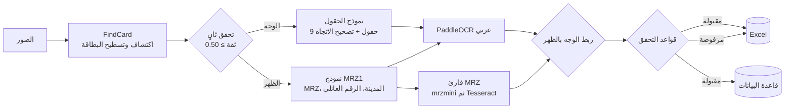

# idcard-extractor

نظام لقراءة البطاقة الوطنية العراقية الموحّدة من الصور: يربط **الوجه** بـ**الظهر**، ويتحقق من تطابق بيانات الوجهين، ثم يصدّر الهويات المقبولة إلى **Excel** وإلى **جدول في قاعدة بياناتك**.

[](LICENSE)


[English](README.md)

- **الاكتشاف:** نموذج YOLOv8 للتقطيع يجد كل البطاقات في الصورة (أكثر من بطاقة في الصورة الواحدة، وبأي زاوية)، ويسطّح كل بطاقة، ثم يتحقق من نوعها مرة ثانية.
- **القراءة:** نموذج YOLO يحدد مواقع الحقول، وPaddleOCR يقرأ النص العربي، ويُحلَّل الـMRZ في الظهر مع أرقام التحقق.
- **الربط:** يُربط كل وجه بظهره ولو كانا في صورتين مختلفتين، بالرقم الوطني أولاً ثم برقم القيد. لا يُدمج وجهان لا تجمعهما علاقة مؤكدة.
- **التحقق:** يجب أن يتطابق الوجهان في الرقم الوطني ورقم القيد والجنس، وأن يكون تاريخ الميلاد تاريخاً حقيقياً متوافقاً مع الرقم الوطني.
- **المخرجات:** ملف Excel يضم البطاقات المقبولة وسبب رفض كل بطاقة مرفوضة، واختيارياً جدول قاعدة البيانات الذي تحدده. ربط الأعمدة يتم عبر ملف YAML أو JSON دون أي تعديل في الكود.

> **بيانات شخصية:** يعالج هذا البرنامج وثائق هوية وطنية. استخدمه فقط على أساس قانوني، ووفق قوانين حماية البيانات المعمول بها. راجع قسم [الخصوصية والأمان](#الخصوصية-والأمان).

---

## آلية العمل



| المرحلة | الوحدة | الوظيفة |
|---------|--------|---------|
| اكتشاف البطاقة | `detection/card_detector.py` | تقطيع البطاقات، تصحيح المنظور، ثم إعادة الاكتشاف على البطاقة المسطّحة |
| الاتجاه | `detection/orientation.py` | اختيار 0°/90°/180°/270° للوجه من توزيع الحقول، وقلب الظهر إن لم يظهر الـMRZ |
| الحقول | `detection/field_detector.py` | الوجه: `name dad gf last mom gm gn id id2`، الظهر: `MRZ city nu_f` |
| قراءة النص | `ocr/text_reader.py` | PaddleOCR بنموذج `arabic_PP-OCRv5_mobile_rec` |
| الـMRZ | `ocr/mrz_reader.py` | `mrzmini` أولاً، ثم Tesseract مع معالجة إضافية ومحلّل TD1 مدمج |
| الربط والتحقق | `processing/` | ربط الوجهين، ثم قواعد التحقق وبناء السجل النهائي |
| التصدير | `exporters/excel.py` و`db/` | ملف Excel، وكاتب قاعدة بيانات بربط أعمدة قابل للتخصيص |

يتعرف نموذج FindCard أيضاً على وثائق أخرى (`addres` و`car` و`drive`). تظهر هذه في التقرير كنوع غير مدعوم ولا تُعالَج.

## التثبيت

**المتطلبات**

- Python بإصدار **3.12** أو أحدث.
- برنامج **Tesseract OCR** (لازم لقراءة الـMRZ):
  - Ubuntu/Debian: `sudo apt install tesseract-ocr`
  - macOS: `brew install tesseract`
  - Windows: ثبّت [Tesseract for Windows](https://github.com/UB-Mannheim/tesseract/wiki)، ثم أضفه إلى `PATH` أو حدّد مساره في `TESSERACT_CMD` داخل `.env`.
- اختياري: بطاقة رسوميات NVIDIA. ثبّت نسخ CUDA من PyTorch وPaddlePaddle حسب التعليمات الرسمية لكل منهما.

**الخطوات**

```bash
git clone https://github.com/<owner>/<repo>.git
cd <repo>
python -m venv .venv
source .venv/bin/activate          # Windows: .venv\Scripts\activate
pip install -r requirements.txt
pip install -e .

python scripts/download_weights.py --base-url https://github.com/<owner>/<repo>/releases/download/v1.0.0

cp .env.example .env               # ثم عدّل القيم
```

<details>
<summary>التشغيل على Google Colab</summary>

```python
!apt-get -qq install -y tesseract-ocr
!git clone https://github.com/<owner>/<repo>.git
%cd <repo>
!pip install -q -r requirements.txt && pip install -q -e .
!python scripts/download_weights.py --base-url https://github.com/<owner>/<repo>/releases/download/v1.0.0
!idcard-extract run /content/images --excel /content/cards.xlsx
```
</details>

## الاستخدام

```bash
# معالجة كل الصور في مجلد (مع المجلدات الفرعية) وإنتاج ملف Excel
idcard-extract run photos/

# عدة مدخلات، مع تحديد مسار Excel والكتابة في قاعدة البيانات
idcard-extract run front1.jpg back1.jpg batch2/ --excel results.xlsx --db

# أدوات قاعدة البيانات
idcard-extract db check        # مقارنة ملف الربط بالجدول الحقيقي دون أي كتابة
idcard-extract db init         # إنشاء الجدول من ملف الربط إن لم يكن موجوداً (للتجربة)
idcard-extract db retry        # إعادة كتابة السجلات التي فشلت سابقاً
```

رموز الخروج: `0` نجاح، و`1` خطأ لم يُنتج أي مخرجات، و`2` انتهاء التشغيل مع مشكلات (مثل سجلات رفضتها قاعدة البيانات).

## المدخلات والمخرجات

**المدخلات:** صور JPG أو PNG أو BMP أو TIFF أو WebP. قد تحتوي الصورة على بطاقة واحدة أو أكثر، وقد يأتي الوجه والظهر في صورتين مختلفتين، بأي ترتيب وأي زاوية.

**ملخص الطرفية**

```
Card sides detected : 4
Accepted cards      : 1
Rejected            : 2
Excel file          : output/cards_20260924_101500.xlsx
Database            : inserted=1 updated=0 skipped=0 failed=0
```

**ورقة `Cards` في Excel** (مثال ببيانات وهمية):

| الاسم | الاب | الجد | اللقب | الام | اب الام | الرقم الوطني | تاريخ الميلاد | مكان الولادة | الرقم العائلي | الجنس | رقم القيد |
|---|---|---|---|---|---|---|---|---|---|---|---|
| أحمد | علي | حسن | الكعبي | فاطمة | محمد | 127901234567 | 1979-01-05 | بغداد | 12345 | ذكر | A12345678 |

**ورقة `Rejected`:** سطر لكل بطاقة أو وجه مرفوض، فيه رقم البطاقة ونوعها واسم ملف الصورة و[سبب الرفض](#قواعد-التحقق).

## قاعدة البيانات

تكتب طبقة قاعدة البيانات البطاقات المقبولة في **جدول موجود لديك**، أياً كانت أسماء أعمدته وترتيبها. تعمل من خلال ثلاثة أجزاء:

1. **الاتصال:** من متغيرات البيئة فقط، دون أي كلمة مرور في الكود أو في ملف الربط.
2. **ملف الربط:** ملف YAML أو JSON يربط كل عمود في جدولك بحقل من حقول البطاقة.
3. **الكاتب:** يفحص ملف الربط مقابل الجدول الفعلي، ثم يكتب كل بطاقة في معاملة مستقلة.

### 1. الاتصال (`.env`)

SQLite هو الخيار الافتراضي ولا يحتاج إلى خادم. لقواعد البيانات الأخرى، حدّد النوع وثبّت برنامج التشغيل المناسب:

| قاعدة البيانات | `DB_DIALECT` | التثبيت |
|----------------|--------------|---------|
| SQLite | `sqlite` | مدمج |
| PostgreSQL | `postgresql` | `pip install -e ".[postgres]"` |
| MySQL / MariaDB | `mysql` / `mariadb` | `pip install -e ".[mysql]"` |
| SQL Server | `mssql` | `pip install -e ".[mssql]"` + Microsoft ODBC Driver 18 |

```ini
DB_DIALECT=postgresql
DB_HOST=db.example.com
DB_PORT=5432
DB_NAME=registry
DB_USER=idcard_writer
DB_PASSWORD_FILE=/run/secrets/db_password   # أو DB_PASSWORD=...
DB_SSL_MODE=verify-full                      # disable | require | verify-ca | verify-full
DB_SSL_CA=/etc/ssl/certs/registry-ca.pem
```

يمكن استخدام `DATABASE_URL` بدلاً من متغيرات `DB_*` الخاصة بالاتصال. تُرمَّز كلمة المرور بأمان ولا تُكتب أبداً في السجلات.

### 2. ملف الربط (`config/db_mapping.yaml`)

انسخ `config/db_mapping.example.yaml` إلى `config/db_mapping.yaml` (نسخة يتجاهلها git) وصِف فيها جدولك:

```yaml
version: 1
table: citizens
mode: upsert                 # insert | skip_existing | upsert
key_columns: [national_no]   # العمود الذي يميّز البطاقة في skip_existing و upsert

columns:
  national_no: {field: national_id, required: true}
  fname: first_name                          # صيغة مختصرة لـ {field: first_name}
  full_name:
    template: "{first_name} {father_name} {grandfather_name} {family_name}"
  birth_date: date_of_birth                  # عمود DATE: يُخزَّن كتاريخ حقيقي
  birth_date_text: {field: date_of_birth, format: "%d/%m/%Y"}
  gender: {field: sex, values: {"ذكر": "M", "أنثى": "F"}}
  imported_by: {value: idcard-extractor}     # قيمة ثابتة
```

**الحقول المتاحة:** `first_name` (الاسم) و`father_name` (الأب) و`grandfather_name` (الجد) و`family_name` (اللقب) و`mother_name` (الأم) و`maternal_grandfather` (أب الأم) و`national_id` (الرقم الوطني) و`date_of_birth` (تاريخ الميلاد) و`birth_place` (مكان الولادة) و`family_number` (الرقم العائلي) و`sex` (الجنس) و`registration_number` (رقم القيد). وهناك حقول وصفية أيضاً: `card_id` و`front_image` و`back_image` و`match_method` و`processed_at`.

**خيارات كل عمود:**
- `field`: حقل واحد.
- `template`: قالب يجمع عدة حقول.
- `value`: قيمة ثابتة.
- `values`: ترجمة القيم (مثل رموز الجنس).
- `default`: قيمة بديلة عند الفراغ.
- `format`: تخزين التاريخ نصاً بصيغة محددة.
- `required`: رفض السجل إن كانت القيمة فارغة.
- `truncate`: قص النص الطويل بدلاً من الرفض.

الملف المثال يشرح كل خيار.

تظهر أخطاء ملف الربط كلها معاً، مع اقتراح للتصحيح:

```
Invalid mapping file config/db_mapping.yaml:
  - columns.fname.field: unknown field 'frist_name' (did you mean 'first_name'?)
  - key_columns: required when mode is 'upsert' (e.g. the national ID column)
```

### 3. الفحص والكتابة

يقرأ `idcard-extract db check` بنية الجدول من قاعدة البيانات نفسها (SQLAlchemy reflection)، ويكشف قبل أي كتابة:

- الأعمدة غير الموجودة (مع اقتراح الاسم الأقرب).
- أعمدة `NOT NULL` التي لا قيمة افتراضية لها ولا يملؤها ملف الربط.
- أعمدة المفتاح التي لا يحميها مفتاح أساسي أو قيد تفرّد.
- الأعمدة المحسوبة، والأعمدة المربوطة مرتين.

### معالجة الأخطاء

- كل بطاقة تُكتب في **معاملة مستقلة**. عند فشل بطاقة (مفتاح مكرر، أو قيمة أطول من العمود، أو رقم أو تاريخ غير صالح، أو مخالفة قيد) يُسجَّل السبب وتُتخطّى البطاقة، وتكمل الدفعة.
- تُحفظ البطاقات الفاشلة في `DB_FAILED_RECORDS_FILE` بصيغة JSON Lines. بعد إصلاح السبب، يعيد `idcard-extract db retry` كتابتها ويُبقي في الملف ما يزال يفشل فقط.
- بعد 3 أخطاء متتالية في قاعدة البيانات (انقطاع الاتصال أو نقص الصلاحيات مثلاً) تتوقف الكتابة، وتُحفظ البطاقات المتبقية لإعادة المحاولة.
- إن كانت قاعدة البيانات أو ملف الربط غير صالحين عند بدء التشغيل، تتعطل مرحلة قاعدة البيانات برسالة واضحة، ويُنتَج ملف Excel رغم ذلك (رمز الخروج `2`).

### الأمان

- **لا حقن SQL:** تُرسَل القيم دائماً كمعاملات مربوطة (bound parameters) عبر SQLAlchemy Core. ولا يُستخدم اسم جدول أو عمود من ملف الربط إلا بعد التأكد من وجوده في الجدول الفعلي.
- **الأسرار:** بيانات الاعتماد من متغيرات البيئة أو من `DB_PASSWORD_FILE` فقط، والملف `.env` مستثنى من git.
- **التشفير:** TLS لـPostgreSQL وMySQL/MariaDB وSQL Server، مع التحقق من الشهادة (`verify-full`).
- **الخصوصية:** مع `MASK_PII_IN_LOGS=true` (الافتراضي) تُخفى قيم الاستعلامات (`hide_parameters`)، وتُحجب الأرقام الوطنية والأسماء في السجلات ورسائل الأخطاء.

## الإعدادات

كل الإعدادات متغيرات بيئة، تُكتب عادة في `.env` (انظر [`.env.example`](.env.example)). متغيرات البيئة الفعلية لها الأولوية على `.env`. المسارات النسبية تُحسب من مجلد ملف `.env`. أهم المتغيرات:

| المتغير | الافتراضي | الوظيفة |
|---------|-----------|---------|
| `WEIGHTS_DIR` | `models/weights` | مجلد أوزان النماذج |
| `YOLO_DEVICE` / `OCR_DEVICE` | تلقائي / `cpu` | المعالج المستخدم |
| `TESSERACT_CMD` | `tesseract` | مسار برنامج Tesseract |
| `DETECT_CONF`, `SECOND_PASS_CONF`, `ORIENTATION_MARGIN` | `0.25`, `0.50`, `0.10` | عتبات الاكتشاف |
| `OUTPUT_DIR` | `output` | مجلد ملفات Excel |
| `MASK_PII_IN_LOGS` | `true` | حجب البيانات الشخصية في السجلات |
| `DB_DIALECT`, `DB_HOST`, `DB_PORT`, `DB_NAME`, `DB_USER` | `sqlite` | الاتصال بقاعدة البيانات |
| `DB_PASSWORD` / `DB_PASSWORD_FILE` | — | كلمة المرور، أو ملف يحتويها |
| `DB_SSL_MODE`, `DB_SSL_CA` | `disable` | التشفير |
| `DB_MAPPING_FILE` | `config/db_mapping.yaml` | ملف الربط |
| `DB_FAILED_RECORDS_FILE` | `output/db_failed_records.jsonl` | ملف إعادة المحاولة (`none` لتعطيله) |

القائمة الكاملة في [README.md](README.md#configuration-reference).

## قواعد التحقق

تُقبل البطاقة فقط إذا رُبط وجهها بظهرها ونجحت كل القواعد. أسباب الرفض:

| السبب | المعنى |
|-------|--------|
| `لا يوجد ظهر` / `لا يوجد وجه` | لم يُعثر على الوجه أو الظهر المقابل |
| `الرقم الوطني غير موجود` | لم يُقرأ الرقم الوطني من أي من الوجهين |
| `الرقم الوطني غير صالح` | الرقم الوطني ليس 12 رقماً |
| `اختلاف الرقم الوطني بين Text و MRZ` | الرقم الوطني في الوجه يختلف عنه في الـMRZ |
| `اختلاف رقم القيد بين Text و MRZ` | رقم القيد في الوجه يختلف عنه في الـMRZ |
| `رقم القيد غير صالح` | رقم القيد ليس حرفاً أو حرفين تليها أرقام (9 خانات) |
| `gf و last متطابقان` | اسم الجد مطابق للقب، أي أن أحد الحقلين قُرئ خطأً |
| `تاريخ الميلاد غير صالح أو غير موجود في MRZ` | تاريخ الميلاد مفقود أو ليس تاريخاً حقيقياً |
| `سنة الميلاد لا تطابق الخانتين الثالثة والرابعة من الرقم الوطني` | سنة الميلاد لا تطابق الرقم الوطني |
| `الجنس غير قابل للتحديد` / `الجنس في Text لا يطابق الجنس في MRZ` | الجنس غير مقروء، أو يختلف بين الوجهين |
| `فشل التحقق الثاني من نوع البطاقة (FindCard)` | البطاقة المسطّحة لم تجتز الاكتشاف الثاني |
| `نوع مستند غير مدعوم: …` | وثيقة من نوع آخر (مثل إجازة السوق) |
| `خطأ أثناء معالجة البطاقة` | خطأ غير متوقع أثناء معالجة هذا الوجه (راجع السجل) |

## الخصوصية والأمان

- لا ترفع إلى المستودع صور بطاقات حقيقية أو مخرجات أو سجلات أو ملف `.env`. يستثني `.gitignore` افتراضياً الصور وجداول البيانات وقواعد البيانات وملفات JSON Lines والسجلات والأوزان. استخدم بيانات وهمية في الاختبارات.
- لا يحفظ النظام صور البطاقات. تُمرَّر صورة الـMRZ إلى القارئ من الذاكرة، ويمررها `mrzmini` إلى Tesseract عبر مجلد مؤقت يُحذف فوراً.
- ملفات Excel وقاعدة البيانات وملف السجلات الفاشلة تحتوي بيانات شخصية. احفظها بصلاحيات مقيّدة واحذفها عند انتهاء الحاجة إليها.
- استخدم حساب قاعدة بيانات محصوراً في الجدول المستهدف: `SELECT` و`INSERT`، و`UPDATE` عند استخدام `upsert`.

## التطوير

```bash
pip install -r requirements-dev.txt   # لا حاجة لمكتبات التعلم العميق
pip install -e . --no-deps
pytest
ruff check .
```

تغطي الاختبارات التطبيع وقواعد التحقق وتحليل الـMRZ (بالنموذج الرسمي من ICAO) والربط وتقدير الاتجاه وتصدير Excel والإعدادات وواجهة الأوامر. وتختبر طبقة قاعدة البيانات على قواعد SQLite حقيقية، بما في ذلك محاولات الحقن والتكرار وأسماء الجداول والأعمدة العربية وانقطاع الاتصال وإعادة المحاولة. تُشغَّل الاختبارات تلقائياً على GitHub Actions مع كل دفع.

## أوزان النماذج

الأوزان غير محفوظة في git. تُنشر كملفات مرفقة بالإصدار (Release)، ويثبّت الملف `models/SHA256SUMS` بصماتها:

```bash
python scripts/download_weights.py --base-url https://github.com/<owner>/<repo>/releases/download/v1.0.0
python scripts/download_weights.py --verify    # التحقق من الملفات الموجودة
```

## الترخيص

[GNU AGPL-3.0](LICENSE). بُنيت نماذج الاكتشاف بمكتبة [Ultralytics YOLO](https://github.com/ultralytics/ultralytics) المرخصة بـAGPL-3.0، وتحمل الأوزان المدرّبة الترخيص نفسه.
