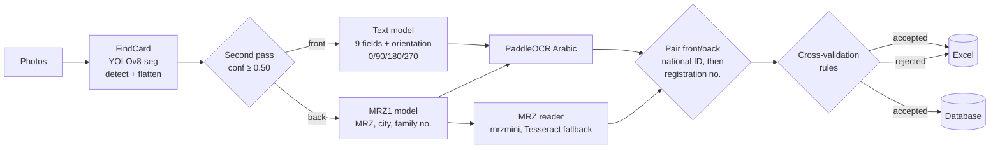
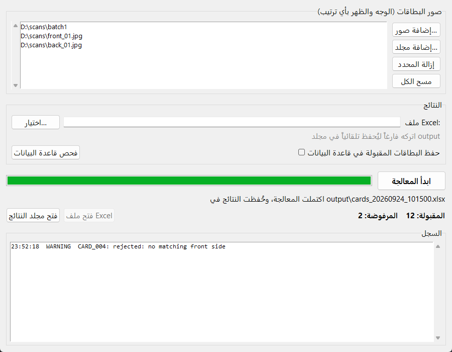

# idcard-extractor

Read Iraqi unified national ID cards from photos, pair each **front** with its **back**, cross-validate the two sides, and export the verified identities to **Excel** and to **your own database table**.

[](LICENSE)


[العربية](README.ar.md)

- **Detection**: YOLOv8 segmentation finds every card in a photo (several cards per photo, any rotation), flattens it, and double-checks its class.
- **Reading**: a YOLO field detector locates each field, PaddleOCR reads the Arabic text, and the MRZ on the back is parsed with check digits.
- **Pairing**: fronts and backs coming from *different* photos are paired by national ID, or by registration number as a fallback. Unrelated sides are never combined.
- **Validation**: the two sides must agree (national ID, registration number, sex), and the date of birth must be a real date matching the national ID.
- **Outputs**: an Excel workbook (accepted cards plus the reason for every rejection) and, optionally, a database table of your choice. The column mapping lives in a YAML/JSON file, so no code changes are needed.

> **Personal data.** This software processes national identity documents. Use it only with a lawful basis, and comply with the data-protection law that applies to you. See [Privacy](#privacy-and-security).

---

## Contents

- [How it works](#how-it-works)
- [Project layout](#project-layout)
- [Installation](#installation)
- [Usage](#usage)
- [Input and output](#input-and-output)
- [Database](#database)
- [Configuration reference](#configuration-reference)
- [Validation rules](#validation-rules)
- [Privacy and security](#privacy-and-security)
- [Development](#development)
- [Model weights](#model-weights)
- [License](#license)

---

## How it works



| Stage | Module | What happens |
|-------|--------|--------------|
| Card detection | `detection/card_detector.py` | Segments cards, fixes perspective, re-runs the detector on the flattened card (second pass). |
| Orientation | `detection/orientation.py` | Scores the field layout to choose 0°/90°/180°/270° for the front; flips the back when no MRZ is found. |
| Field detection | `detection/field_detector.py`, `yolo_utils.py` | Front: `name dad gf last mom gm gn id id2`. Back: `MRZ city nu_f`. |
| Text OCR | `ocr/text_reader.py` | PaddleOCR `arabic_PP-OCRv5_mobile_rec` on each field crop. |
| MRZ | `ocr/mrz_reader.py` | `mrzmini`; when its reading is not a TD1 verified by check digits, Tesseract with extra preprocessing and a built-in TD1 parser is tried too, and the better reading is kept. |
| Pairing | `processing/matching.py` | National ID first, registration number second; unmatched sides are reported. |
| Validation | `processing/validation.py`, `rules.py` | Cross-checks both sides and builds the final record. |
| Export | `exporters/excel.py`, `db/` | Excel workbook; database writer with a configurable mapping. |

The FindCard model also recognizes other documents (`addres`, `car`, `drive`). They are reported as unsupported and are not processed.

## Project layout

```
idcard-extractor/
├── src/idcard_extractor/
│   ├── cli.py                 command line: run, db check / init / retry
│   ├── gui.py                 desktop interface (Tkinter)
│   ├── config.py              settings from environment variables / .env
│   ├── pipeline.py            end-to-end orchestration
│   ├── models.py              data classes shared by all stages
│   ├── detection/             YOLO helpers, card detection, orientation
│   ├── ocr/                   PaddleOCR text, MRZ reading and TD1 parsing
│   ├── processing/            normalization, rules, pairing, validation
│   ├── exporters/             Excel output
│   └── db/                    connection, mapping, writer, setup
├── config/db_mapping.example.yaml
├── run_gui.bat                Windows launcher of the desktop interface
├── models/SHA256SUMS          checksums of the model weights
├── scripts/download_weights.py
├── tests/                     unit and integration tests (synthetic data)
├── .env.example
├── requirements.txt           exact runtime versions
└── requirements-dev.txt       lightweight test/lint environment
```

## Installation

**Requirements**

- Python **3.12** or newer.
- The **Tesseract OCR** binary, used to read the MRZ:
  - Ubuntu/Debian: `sudo apt install tesseract-ocr`
  - macOS: `brew install tesseract`
  - Windows: install [Tesseract for Windows](https://github.com/UB-Mannheim/tesseract/wiki), then add it to `PATH` or set `TESSERACT_CMD` in `.env`.
- Optional: an NVIDIA GPU. Install the CUDA builds of PyTorch and PaddlePaddle by following their official instructions.

**Steps**

```bash
git clone https://github.com/Hai800Z/Id_iraqi.git
cd Id_iraqi
python -m venv .venv
source .venv/bin/activate          # Windows: .venv\Scripts\activate
pip install -r requirements.txt
pip install -e .

# Model weights (see "Model weights")
python scripts/download_weights.py --base-url https://github.com/Hai800Z/Id_iraqi/releases/download/v1.0.0

cp .env.example .env               # then edit it
```

<details>
<summary>Running on Google Colab</summary>

```python
!apt-get -qq install -y tesseract-ocr
!git clone https://github.com/Hai800Z/Id_iraqi.git
%cd Id_iraqi
!pip install -q -r requirements.txt && pip install -q -e .
!python scripts/download_weights.py --base-url https://github.com/Hai800Z/Id_iraqi/releases/download/v1.0.0
!idcard-extract run /content/images --excel /content/cards.xlsx
```
</details>

## Usage

### Desktop interface



On Windows, double-click **`run_gui.bat`**. Elsewhere, run `idcard-extract-gui` (or `python -m idcard_extractor.gui`).

1. Add photos or folders.
2. Optionally choose the Excel file and tick the database option.
3. Press **ابدأ المعالجة** (start).

The models load once, on the first run. Progress, the log, the accepted/rejected counts and a button to open the Excel file are shown in the window.

### Command line

```bash
# Process every image in a folder (sub-folders included) and write Excel
idcard-extract run photos/

# Several inputs, explicit Excel path, and write to the database too
idcard-extract run front1.jpg back1.jpg batch2/ --excel results.xlsx --db

# Database utilities
idcard-extract db check        # compare the mapping with the real table (writes nothing)
idcard-extract db init         # create the mapped table if missing (for trials)
idcard-extract db retry        # write the records that failed earlier

# Global options go before the command
idcard-extract --env-file /etc/idcard/.env --log-level DEBUG run photos/
```

`python -m idcard_extractor ...` works too. Exit codes are `0` for success, `1` for an error with nothing produced, and `2` when the run finished with problems (for example, records the database refused).

The same pipeline is available from Python:

```python
from idcard_extractor.config import load_settings
from idcard_extractor.pipeline import CardPipeline, collect_images

result = CardPipeline(load_settings()).run(collect_images(["photos/"]))
for record in result.records:
    print(record.national_id, record.first_name, record.date_of_birth)
for card in result.rejected:
    print(card.card_id, card.reason)
```

## Input and output

**Input**: JPG/PNG/BMP/TIFF/WebP photos. A photo may contain one or several cards, and fronts and backs may be in different photos, in any order and any rotation.

**Console summary**

```
Card sides detected : 4
Accepted cards      : 1
Rejected            : 2
Excel file          : output/cards_20260924_101500.xlsx
Database            : inserted=1 updated=0 skipped=0 failed=0
```

**Excel, sheet `Cards`** (synthetic example):

| الاسم | الاب | الجد | اللقب | الام | اب الام | الرقم الوطني | تاريخ الميلاد | مكان الولادة | الرقم العائلي | الجنس | رقم القيد |
|---|---|---|---|---|---|---|---|---|---|---|---|
| أحمد | علي | حسن | الكعبي | فاطمة | محمد | 127901234567 | 1979-01-05 | بغداد | 12345 | ذكر | A12345678 |

**Excel, sheet `Rejected`**: one row per rejected card or side, with the card ID, the detected class, the source file, and the [reason](#validation-rules).

**Database row** with the example mapping (`config/db_mapping.example.yaml`):

| national_no | fname | full_name | birth_date | gender | document_no | source_file | imported_at |
|---|---|---|---|---|---|---|---|
| 127901234567 | أحمد | أحمد علي حسن الكعبي | 1979-01-05 | M | A12345678 | IMG_0412.jpg | 2026-09-24 10:15:00 |

## Database

The database layer writes accepted cards into **an existing table**, whatever its column names and layout. Three pieces work together:

1. **Connection**: environment variables only; no credentials in code or in the mapping file.
2. **Mapping**: a YAML or JSON file mapping each column of *your* table to an extracted field.
3. **Writer**: checks the mapping against the live table, then writes each card in its own transaction.

### 1. Connection (`.env`)

SQLite is the default and needs no server. For a server database, set the dialect and install its driver:

| Database | `DB_DIALECT` | Driver install |
|----------|--------------|----------------|
| SQLite | `sqlite` | built in |
| PostgreSQL | `postgresql` | `pip install -e ".[postgres]"` |
| MySQL / MariaDB | `mysql` / `mariadb` | `pip install -e ".[mysql]"` |
| SQL Server | `mssql` | `pip install -e ".[mssql]"` + Microsoft ODBC Driver 18 |

```ini
DB_DIALECT=postgresql
DB_HOST=db.example.com
DB_PORT=5432
DB_NAME=registry
DB_USER=idcard_writer
DB_PASSWORD_FILE=/run/secrets/db_password   # or DB_PASSWORD=...
DB_SSL_MODE=verify-full                      # disable | require | verify-ca | verify-full
DB_SSL_CA=/etc/ssl/certs/registry-ca.pem
```

`DATABASE_URL` can replace the `DB_*` connection variables. Passwords are escaped safely and never logged.

### 2. Mapping (`config/db_mapping.yaml`)

Copy `config/db_mapping.example.yaml` to `config/db_mapping.yaml` and describe your table. The copy is ignored by git.

```yaml
version: 1
table: citizens
mode: upsert                 # insert | skip_existing | upsert
key_columns: [national_no]   # identifies a card for skip_existing / upsert

columns:
  national_no: {field: national_id, required: true}
  fname: first_name                          # shorthand for {field: first_name}
  full_name:
    template: "{first_name} {father_name} {grandfather_name} {family_name}"
  birth_date: date_of_birth                  # DATE column: stored as a real date
  birth_date_text: {field: date_of_birth, format: "%d/%m/%Y"}
  gender: {field: sex, values: {"ذكر": "M", "أنثى": "F"}}
  imported_by: {value: idcard-extractor}     # constant
```

Available fields: `first_name`, `father_name`, `grandfather_name`, `family_name`, `mother_name`, `maternal_grandfather`, `national_id`, `date_of_birth`, `birth_place`, `family_number`, `sex`, `registration_number`, plus the metadata fields `card_id`, `front_image`, `back_image`, `match_method`, `processed_at`.

Column options are `field`, `template`, `value`, `values` (translation), `default`, `format` (dates as text), `required`, and `truncate`. The example file documents each one.

Invalid mappings are reported with all problems at once, with suggestions:

```
Invalid mapping file config/db_mapping.yaml:
  - columns.fname.field: unknown field 'frist_name' (did you mean 'first_name'?)
  - key_columns: required when mode is 'upsert' (e.g. the national ID column)
```

### 3. Checking and writing

```bash
idcard-extract db check
# WARNING: column 'FName' matched to 'fname' (different letter case)
# mapping file config/db_mapping.yaml -> table 'citizens' (mode=upsert): OK
```

`db check` reads the table structure from the database (SQLAlchemy reflection) and reports problems before anything is written:

- mapped columns that do not exist (with suggestions);
- `NOT NULL` columns without a default that the mapping leaves empty;
- key columns without a primary key or unique constraint;
- computed columns, and columns mapped twice.

### Error handling

- Each card is written in **its own transaction**. A failing card (duplicate key, value too long, invalid number or date, constraint violation) is logged and skipped, and the batch continues.
- Failed cards are saved to `DB_FAILED_RECORDS_FILE` (JSON Lines). After fixing the cause, `idcard-extract db retry` writes them again and keeps only those that still fail.
- After 3 consecutive database errors (lost connection, missing permissions…), writing stops. The remaining cards are saved for a retry instead of failing one by one.
- If the database or the mapping is unusable when a run starts, the database stage is disabled with a clear message, and the Excel output is still produced (exit code `2`).

### Security

- **No SQL injection**: values are always sent as bound parameters through SQLAlchemy Core. Table and column names from the mapping are used only after they were found in the reflected table.
- **Secrets**: credentials come only from the environment or from `DB_PASSWORD_FILE`. `.env` is git-ignored.
- **Encryption**: TLS for PostgreSQL, MySQL/MariaDB, and SQL Server, with certificate verification (`verify-full`).
- **Privacy**: with `MASK_PII_IN_LOGS=true` (the default), SQL parameters are hidden (`hide_parameters`), and national IDs and names are masked in logs and error messages.

## Configuration reference

All settings are environment variables, usually set in `.env` (see [`.env.example`](.env.example)). Real environment variables override `.env`. Relative paths are resolved against the folder of the `.env` file.

| Variable | Default | Purpose |
|----------|---------|---------|
| `WEIGHTS_DIR` | `models/weights` | Folder of `findCard.pt`, `text.pt`, `MRZ1.pt` |
| `FINDCARD_WEIGHTS`, `TEXT_WEIGHTS`, `MRZ_WEIGHTS` | files in `WEIGHTS_DIR` | Per-model overrides |
| `YOLO_DEVICE` | automatic | `cpu`, `0`, `cuda:0`… |
| `OCR_MODEL_NAME` | `arabic_PP-OCRv5_mobile_rec` | PaddleOCR recognition model |
| `OCR_DEVICE` | `cpu` | `cpu`, `gpu`, `gpu:0` |
| `TESSERACT_CMD` | `tesseract` on PATH | Path of the Tesseract binary |
| `DETECT_CONF` | `0.25` | YOLO confidence threshold |
| `SECOND_PASS_CONF` | `0.50` | Minimum confidence of the card re-check |
| `ORIENTATION_MARGIN` | `0.10` | Relative margin needed to rotate an uncertain front |
| `OUTPUT_DIR` | `output` | Default folder of the Excel files |
| `LOG_LEVEL`, `LOG_FILE` | `INFO`, none | Logging |
| `MASK_PII_IN_LOGS` | `true` | Mask identifiers and names in logs and DB errors |
| `DB_DIALECT` | `sqlite` | `sqlite`, `postgresql`, `mysql`, `mariadb`, `mssql` |
| `DB_HOST`, `DB_PORT`, `DB_NAME`, `DB_USER` | none (`DB_NAME=data/idcards.db` for SQLite) | Connection |
| `DB_PASSWORD` / `DB_PASSWORD_FILE` | none | Password, or a file containing it |
| `DATABASE_URL` | none | Full SQLAlchemy URL; overrides the `DB_*` connection variables |
| `DB_DRIVER` | per dialect | e.g. `postgresql+psycopg2`, `mysql+mysqldb` |
| `DB_SSL_MODE`, `DB_SSL_CA`, `DB_SSL_CERT`, `DB_SSL_KEY` | `disable` | TLS settings |
| `DB_ODBC_DRIVER` | `ODBC Driver 18 for SQL Server` | SQL Server only |
| `DB_CONNECT_TIMEOUT` | `10` | Seconds |
| `DB_MAPPING_FILE` | `config/db_mapping.yaml` | Mapping file |
| `DB_FAILED_RECORDS_FILE` | `output/db_failed_records.jsonl` | Retry file (`none` disables it) |

## Validation rules

A card is accepted only when a front and a back are paired and every rule passes. Rejection reasons are in Arabic because they are shown to operators:

| Reason | Meaning |
|--------|---------|
| `لا يوجد ظهر` / `لا يوجد وجه` | No matching back / front was found |
| `الرقم الوطني غير موجود` | National ID read on neither side |
| `الرقم الوطني غير صالح` | National ID is not 12 digits |
| `اختلاف الرقم الوطني بين Text و MRZ` | Front and MRZ national IDs differ |
| `اختلاف رقم القيد بين Text و MRZ` | Front and MRZ registration numbers differ |
| `رقم القيد غير صالح` | Registration number is not 1–2 letters + digits (9 characters) |
| `gf و last متطابقان` | Grandfather name equals family name (misread field) |
| `تاريخ الميلاد غير صالح أو غير موجود في MRZ` | MRZ date of birth missing or not a real date |
| `سنة الميلاد لا تطابق الخانتين الثالثة والرابعة من الرقم الوطني` | Birth year differs from digits 3–4 of the national ID |
| `الجنس غير قابل للتحديد` / `الجنس في Text لا يطابق الجنس في MRZ` | Sex unreadable, or front and MRZ disagree |
| `فشل التحقق الثاني من نوع البطاقة (FindCard)` | The flattened card failed the second detection pass |
| `نوع مستند غير مدعوم: …` | Another document type (e.g. driving licence) |
| `خطأ أثناء معالجة البطاقة` | Unexpected error while processing this side (see the log) |

## Privacy and security

- Never commit real card photos, outputs, logs, or `.env`. `.gitignore` blocks images, spreadsheets, databases, JSON Lines files, logs, and weights by default. Keep test data synthetic.
- The pipeline does not save card images. The MRZ crop is handed to the reader in memory; `mrzmini` passes it to Tesseract through a temporary folder that is deleted right away.
- Excel files, the database, and the failed-records file contain personal data. Store them with restricted access, and delete them when no longer needed.
- Use a database account limited to the target table: `SELECT` and `INSERT`, plus `UPDATE` for `upsert`.

## Development

```bash
pip install -r requirements-dev.txt   # no deep-learning packages needed
pip install -e . --no-deps
pytest                                # unit + integration tests on synthetic data
ruff check .
```

The tests cover normalization, validation rules, MRZ parsing (ICAO specimen), pairing, orientation scoring, Excel export, configuration, the CLI, and the database layer against real SQLite databases. The database tests include injection attempts, duplicates, Arabic table and column names, outages, and retries. GitHub Actions runs lint and tests on every push (`.github/workflows/ci.yml`).

## Model weights

The weights are not stored in git. They are published as release assets, and `models/SHA256SUMS` pins their checksums:

| File | Model | Classes |
|------|-------|---------|
| `findCard.pt` | YOLOv8n-seg | `addres`, `back`, `car`, `drive`, `iraq id card` |
| `text.pt` | YOLOv8s | `dad`, `gf`, `gm`, `gn`, `id`, `id2`, `last`, `mom`, `name` |
| `MRZ1.pt` | YOLOv8s | `MRZ`, `city`, `nu_f` |

```bash
python scripts/download_weights.py --base-url https://github.com/Hai800Z/Id_iraqi/releases/download/v1.0.0
python scripts/download_weights.py --verify    # check files already present
```

Maintainers publish them with the [GitHub CLI](https://cli.github.com/):

```bash
gh release create v1.0.0 models/weights/findCard.pt models/weights/text.pt models/weights/MRZ1.pt \
  --title "v1.0.0" --notes "Model weights (see models/SHA256SUMS)"
```

## License

[GNU AGPL-3.0](LICENSE). The detectors are built with [Ultralytics YOLO](https://github.com/ultralytics/ultralytics), which is AGPL-3.0; the trained weights carry the same license. Other components: PaddleOCR (Apache-2.0), mrzmini (MIT), SQLAlchemy (MIT), openpyxl (MIT).
